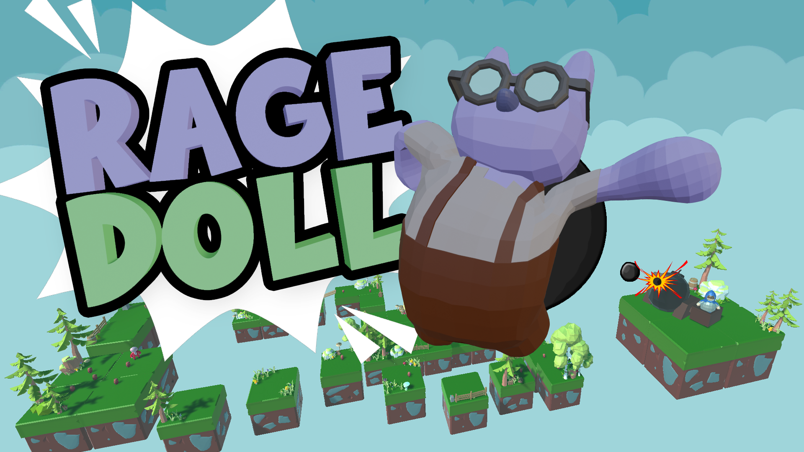
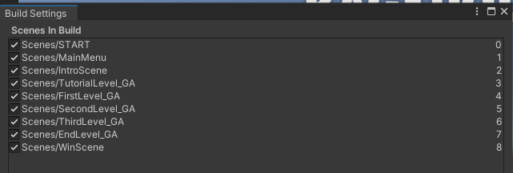

# Ragedoll - The last CodeLab
Task documentation, final thoughts and Requirement List can be found [here](https://jrbeer.notion.site/Ragedoll-Documentation-f8e3f22615bd4565ab3465065003a3c4)


made by:

[Beer Jonas](https://github.com/jb-cc)

[Bhogal Arjun](https://github.com/arjbhogal)

[Helm Finn](https://github.com/nnifHM)

[Meyer Klemens](https://github.com/KlemensCC221011)


# About
The game is designed to be easily understandable, enjoyable, and rage-inducing (as per the name)

RAGEDOLL revolves around a Character, who has ragdoll-based movement, but desires to finally get back his normal animations. To achieve this, he has to pass though various levels with enemies with special abilites.


# How to compile and run the Program (user guidelines)

- Clone the repository
    
    ```bash
    git clone https://github.com/jb-cc/CCL4.git
    ```
    
- Open the project in unity version 2022.3.4f1
- Go to the build settings, and select these scenes (Make sure that the START Scene is the first one with index 0)
    
    0. Scenes/START
    1. Scenes/MainMenu
    2. Scenes/IntroScene
    3. Scenes/Audio_Levels/TutorialLevel_GA
    4. Scenes/Audio_Levels/FirstLevel_GA
    5. Scenes/Audio_Levels/SecondLevel_GA
    6. Scenes/Audio_Levels/ThirdLevel_GA
    7. Scenes/Audio_Levels/EndLevel_GA
    8. Scenes/WinScene

    

    
- Click “Build and run” for windows
- Play the game :)

# What Challenges were found, and how were they solved?

- Getting Animations right, difficult and different because we worked with a Ragdoll that copies animations from another non Ragdoll Object. We solved it by rotating and moving the bones like a real human would, because that way the ragdoll could mimic the animation better, because of its limited Joint Rotations.
- Attaching Clothes to rig was a challenge because when extruding the character to have Clothing etc. the other part of clothing would snap inside to the Rig bones and the character looked terrible. We found a solution using seperated clothes from body, then attaching the bones rig to the body alone, then attaching clothes to body and work with auto weighting and weight painting.
- Sound Issues with Enemies and Endless loops. We had issues were some enemies had endless loops of audio playing. Conditions and Wise Testing fixed this after some time. (??? AJ Ka wie du das gelöst hast)
- Clean looking Movement was also challenging, because everything is physics based, so getting values right that the character could move not that fast but not that slow, and also implementing a nice and realistic looking jump mechanic was difficult. It was just fixed by some Posts on the internet and brute force.
- Setting up Ragdoll and Configurable Joints were painful because these Joints have so much settings and values that you need to tweak and firstly understand in order for it to work like you want.
- Grabbing objects/ Attaching to hand was extremly complex. This is because the Unity Parenting/Child system is very difficult to understand in our opinion. If you set a position of a child its not really the value that you put in and also the rotation is off because its sometimes based on what the parent has as rotation and so on and on. Luckily we managed this week to attach the key perfectly into the hand by creating another Empty GameObject and setting there the rotation and position of the key beforehand and after attaching we just move the key inside this Empty object container.
- We had a Problem where the Player Character turned invisible at certain angles. The problem was when starting the game the Mesh Object stayed in place and the character itself moved away. When the camera couldnt see the Mesh anymore the player also turned invisible. We just fixed this by updating the Mesh Transform to the moving object as well.
- Enemy AI was complex at first usage, but after some time we found out how to manage.
- Enemy attack behaviour was weird to handle. We needed to find out how the ranges and animations correspond well with each other so it works as intended. Also after some time and talking with tutors we got our solutions.
- For the UI it was challenging to show only information that also should be displayed. Many conditions and bools fixed this after some time.

# How did the Teammates Collaborate with each other?

The team collaborated very effectively using a strategy that involved daily stand-up meetings and calls. The main communication tools included WhatsApp for messaging, Discord for file transfers and calls, and Miro as an organization and task distribution platform. Calls lasted several hours each day, ensuring everyone was consistently available for questions and task assignments. This comprehensive approach not only boosted motivation among team members but also contributed to the overall success of the communication platform strategy.

As stated in the initial Presentation, while we had designated roles for Game Design, 3D modelling / Animation, Development and Audio, we always helped each other out, even if it wasn’t within our roles.

https://miro.com/app/board/uXjVKIsayt8=/?share_link_id=246443034560

# What could be done next

- implementing Punch functionality to hit enemies. currently only Animation in the game, no logic
- Grabbing functionality. It would be cool if the player is able to hold onto objects like walls etc. Also more grabbable Objects to throw would be funny
- More and more difficult Levels.
- Polishing up Sound Design and fixing some Parts
- Movement could always be done even smoother
- We could keep adding more Fractal Trees

# Reflections

- We are very happy with the outcome after all
- We can say we generally achieved what we wanted. Of course some more complex things were left out. Our game is fun to play and looks nice.
- The Team worked out very well, everybody did their part. Communitcation and Workflow were satisfying.
- Working with GitHub Desktop and creating Scenes for each Member were really good and helpful ideas. (Almost no Merge conflicts!)

# Contact
If you have any questions, ideas or anything else, you can contact us here: cc221012@fhstp.ac.at
